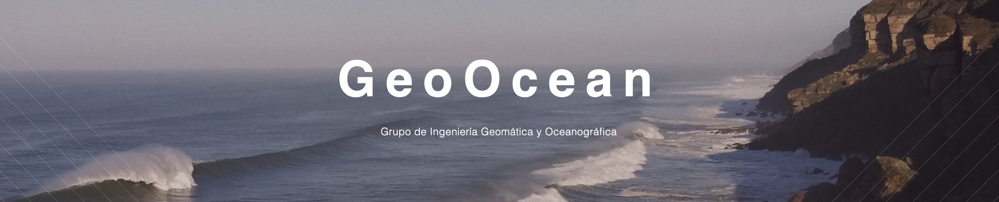

# GeoOcean Research Group

  

## About Us
The **Geomatics and Ocean Engineering Group (GeoOcean)** at the *University of Cantabria* is an active research group with more than 15 years of accumulated expertise.  
We work at the intersection of **coastal engineering, ocean data science, numerical modeling, and climate**, developing open-source tools and scientific methods for coastal risk analysis.

---

## Research Focus
Our recent research lines include:

- <strong>Statistical & numerical modeling</strong> of wave climate, coastal hazards, and climate-change scenarios.  
- <strong>Coastal flooding risk assessment</strong>, including variability and extremes.  
- <strong>UAV-based coastal monitoring</strong> for geomorphology and hazard detection.  
- <strong>Forecast systems</strong> for swells, tropical cyclones, and compound flooding using machine learning and metamodels.  
- <strong>Open-source frameworks</strong> to enable reproducible coastal and climate risk analysis.

---

  

**BlueMath** is our flagship open-source platform for **statistical analysis, probabilistic modeling, metamodeling, and coastal-hazard simulation**.  
It provides a unified environment for:

- 📈 Exploratory coastal & ocean data analysis  
- 📉 Probabilistic modeling (extremes, stochastic processes, uncertainty)  
- ⚙️ Numerical metamodels for waves, surge, flooding  
- 🌐 High-resolution climate-change risk assessment  
- 🤝 Reproducible research and collaborative workflows  

Explore the full project: **https://github.com/GeoOcean/BlueMath**

---

## Packages & Toolkits

- **[bluemath-tk](https://github.com/GeoOcean/bluemath_tk)** – Statistical and probabilistic toolkit powering BlueMath workflows.  
- **[pymesh2d](https://github.com/GeoOcean/pymesh2d)** – 2D unstructured mesh generation and manipulation.

---

## Teaching Materials
- **[Beach Engineering](https://github.com/GeoOcean/BeachEngineering)** – Models for beach morphodynamics.  
- **[Ondas](https://github.com/GeoOcean/Ondas)** – Wave transformation and coastal processes.  
- **[COMIC](https://github.com/GeoOcean/COMIC)** – Coastal metamodeling for climate-impact studies.
- **[MicroDatosIA](https://github.com/GeoOcean/MicroDatosIA)** - Introduction to programming and machine learning.
- **[Risk Assessment](https://github.com/GeoOcean/Risk-Assessment)** - Flooding risk assessment.

---

## Contributing
We welcome contributions to the BlueMath ecosystem and the GeoOcean open-source tools.  
Feel free to open issues, submit PRs, or propose new modules.

---

## Contact 📬 
**GeoOcean Group – University of Cantabria**  
Department of Water and Environmental Sciences & Technologies  
🔗 https://github.com/GeoOcean
